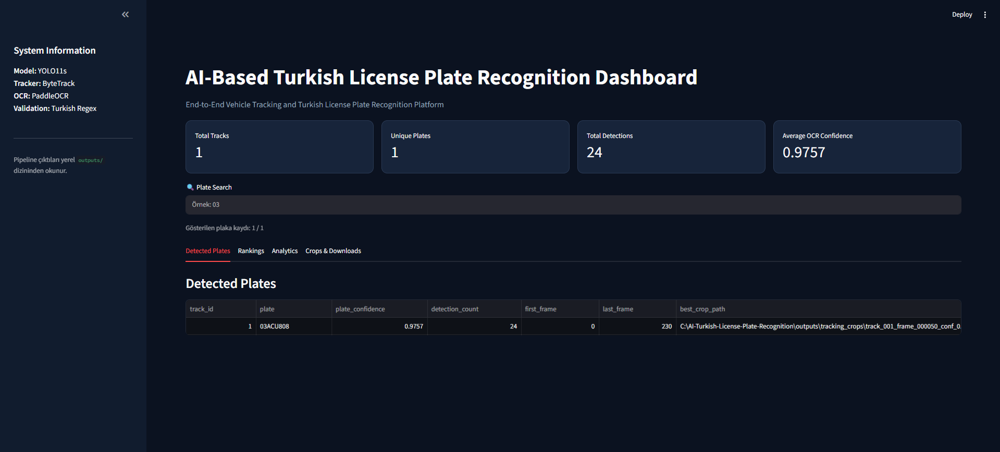

# AI-Based Turkish License Plate Recognition & Tracking System

> End-to-end Turkish License Plate Recognition and Vehicle Tracking Platform built with YOLO11s, ByteTrack, PaddleOCR and Streamlit.


This project detects Turkish license plates in images and videos, tracks them across video frames, reads plate text with OCR, validates the result against Turkish plate rules, and produces CSV, PDF, and dashboard-ready outputs.

## Dashboard Overview



## Analytics


## Automated PDF Report


## Architecture

```mermaid
flowchart LR
    A[Video/Image] --> B[YOLO11 Detection]
    B --> C[ByteTrack Tracking]
    C --> D[Plate Crop Extraction]
    D --> E[PaddleOCR]
    E --> F[Plate Cleaning]
    F --> G[Turkish Validation]
    G --> H[Track Voting]
    H --> I[CSV Export]
    I --> J[PDF Report]
    J --> K[Streamlit Dashboard]
```



## Features

### Detection

- YOLO11s plate detection trained on a custom Turkish license plate dataset
- Image and video inference with configurable confidence and image size
- Plate crop extraction with bounded coordinates and invalid-crop filtering

### Tracking

- ByteTrack multi-object tracking
- Persistent Track ID assignment for video detections
- Track summaries with first/last frame, detection count, and best crop

### OCR

- PaddleOCR text recognition for plate crops
- Turkish-character normalization and plate text cleaning
- Track-based OCR voting to select the most reliable plate text

### Validation

- Turkish plate regex validation for province codes `01-81`, letter blocks, and digit blocks
- OCR confidence filtering and duplicate plate filtering

### Reporting

- Automated PDF generation with pipeline metrics and plate tables
- Pipeline Summary, Detected Plates, Top Plates, System Information, and Crop Samples
- CSV exports for OCR, tracking, unique plates, and final tracked plates

### Analytics

- Interactive Streamlit dashboard
- KPI cards, plate search, analytics charts, crop viewer, CSV download, and PDF download

## Model Performance

| Metric | Value |
| --- | ---: |
| Precision | 96.6% |
| Recall | 99.0% |
| mAP50 | 99.4% |
| mAP50-95 | 88.8% |

Results were measured on the project's Turkish plate dataset. Real-world performance can vary with lighting, camera angle, motion blur, plate visibility, and image resolution.

## Installation

The project targets **Python 3.11**.

```bash
git clone https://github.com/<your-username>/AI-Turkish-License-Plate-Recognition.git
cd AI-Turkish-License-Plate-Recognition
python -m venv .venv
```

Activate the virtual environment:

```bash
# Windows PowerShell
.venv\Scripts\Activate.ps1

# macOS / Linux
source .venv/bin/activate
```

Install dependencies:

```bash
pip install -r requirements.txt
```

## Usage

### Train

```bash
python src/training/train.py
```

### Detection

```bash
python src/main.py --source data/test.jpg
```

### Tracking

```bash
python src/main.py --source data/test.mp4 --tracking
```

### Reporting

```bash
python src/main.py --source data/test.mp4 --tracking --report
```

### Dashboard

```bash
streamlit run src/dashboard/app.py
```

The default pipeline clears prior crop and log outputs before processing. Add `--no-clean` to preserve existing outputs.

## Dashboard Capabilities

- KPI Cards for total tracks, unique plates, total detections, and average OCR confidence
- Plate Search for narrowing results by plate text
- Plotly analytics charts for detection count and OCR confidence by plate
- Crop Viewer for available best plate crops
- CSV Download for `final_tracked_plates.csv`
- PDF Download for the generated license plate report

## Example Output

```text
==================================
Tracking Pipeline Summary
=========================

Tracks: 1
Unique Plates: 1
Best OCR Results: 1

Plate:
03ACU808

Pipeline completed successfully.
```

## PDF Report

When the pipeline runs with `--tracking --report`, it creates:

```text
outputs/reports/license_plate_report.pdf
```

The report includes:

- Pipeline Summary
- Detected Plates
- Top Plates
- System Information
- Crop Samples

## Dashboard

The Streamlit dashboard turns pipeline artifacts into an interactive review interface. It provides an executive overview of detection and OCR quality, sortable plate tables, dark-theme Plotly charts, crop previews, and direct CSV/PDF downloads. The screenshots above illustrate the overview, analytics, and generated report experience.

## Project Structure

```text
src/
├── dashboard/
│   └── app.py
├── detection/
│   └── crop_plates.py
├── logging/
│   └── duplicate_filter.py
├── ocr/
│   ├── batch_ocr.py
│   ├── plate_cleaner.py
│   └── test_ocr.py
├── reporting/
│   └── generate_report.py
├── tracking/
│   ├── plate_tracker.py
│   └── tracked_plate_recognition.py
└── main.py
```

## Outputs

```text
outputs/
├── crops/                         # Detection crop outputs
├── tracking_crops/                # Track-ID crop outputs
├── logs/
│   ├── plate_results.csv
│   ├── unique_plates.csv
│   ├── tracking_results.csv
│   ├── tracking_summary.csv
│   └── final_tracked_plates.csv
└── reports/
    └── license_plate_report.pdf
```

## Future Improvements

- OCR Error Correction Layer
- ONNX Export
- Docker Deployment
- Real-Time RTSP Support
- Multi-Camera Tracking

## Responsible Use

License plate data may be personal data or linkable to personal data. Before deploying this system, evaluate applicable privacy, camera-use, data-retention, and local legal requirements. This project is intended for education, research, and portfolio use.

Built with YOLO11, ByteTrack, PaddleOCR and Streamlit

<!-- Legacy README content below is intentionally hidden.

🚗 Türk araç plakalarının görüntü ve videolarda tespit edilmesi, metin olarak okunması, doğrulanması ve CSV'ye kaydedilmesi için geliştirilen **YOLO11s tabanlı** bilgisayarlı görü projesi.

> **Proje durumu:** Plaka tespiti, ByteTrack tabanlı takip, crop çıkarımı, PaddleOCR ile metin okuma, Türk plaka doğrulama, CSV kayıt hattı ve otomatik PDF raporlama tamamlanmıştır.

## 1. Proje Özeti

Bu projenin amacı, araç görüntülerindeki Türk plakalarını tek bir sınıf olarak tespit eden, güçlü ve genişletilebilir bir altyapı oluşturmaktır. Model; farklı ışık koşulları, bakış açıları ve araç türlerinde plaka bölgesini bulmak üzere özel veri seti ile eğitilmiştir.

🎯 Tespit edilen plaka kırpımları PaddleOCR katmanına aktarılır; metin temizlenir, Türk plaka formatına göre doğrulanır, CSV kaydı üretilir ve istenirse PDF rapor olarak sunulur. ByteTrack ile takip ve otomatik raporlama tamamlanmıştır.

## 2. Özellikler

- YOLO11s ile Türk plakası nesne tespiti
- Tek sınıflı (`license_plate`) özel eğitim altyapısı
- Train / validation / test veri hazırlama hattı
- YOLO etiket formatı ve koordinat aralığı doğrulaması
- Eksik veya bozuk etiketleri ayıklayan veri seti split betiği
- Eğitilen model için değerlendirme ve metrik takibi
- Görüntüler üzerinde hızlı çıkarım desteği
- PaddleOCR ile plaka metni okuma
- Türkçe karakter normalizasyonu, metin temizleme ve regex ile plaka doğrulama
- Toplu OCR işleme ve CSV export
- ByteTrack multi-object tracking ve Track ID assignment
- Track-bazlı OCR voting ile en güvenilir plaka sonucunun seçilmesi
- Vehicle Re-Identification Prevention: track-bazlı oylama ile tekrar kayıtların azaltılması
- Automated PDF Reporting ile pipeline analiz sonuçlarının profesyonel raporlanması
- Pipeline Summary Report
- Detected Plates Table
- Best Plate Crop Samples
- Takip ve raporlama için modüler mimari temeli

## 3. Kullanılan Teknolojiler

| Teknoloji | Kullanım amacı |
| --- | --- |
| 🧠 Python | Uygulama ve veri işleme dili |
| 🧠 Ultralytics YOLO11s | Plaka nesne tespiti ve model eğitimi |
| PyTorch | Derin öğrenme çalışma zamanı |
| OpenCV | Görüntü okuma, işleme ve görselleştirme |
| YAML | YOLO veri seti yapılandırması |
| PaddleOCR | Tespit edilen plaka crop'larının metin olarak okunması |
| CSV | OCR sonuçlarının kayıt altına alınması |
| ByteTrack | Video içindeki plaka nesnelerinin Track ID ile takibi |

## 4. Veri Seti

Ham veri seti aşağıdaki yapıda tutulur:

```text
datasets/raw/turkish_plate_dataset/
├── images/
└── labels/
```

Her görsel için aynı ada sahip bir `.txt` etiket dosyası bulunur. Etiketler YOLO biçimindedir:

```text
class_id x_center y_center width height
```

Koordinatlar görüntü boyutuna göre normalize edilir ve `0–1` aralığında olmalıdır. Projede tek sınıf kullanılır:

```yaml
0: license_plate
```

`src/utils/split_dataset.py` betiği geçerli görsel-etiket çiftlerini denetler, karıştırır ve veriyi `%70 train`, `%20 validation`, `%10 test` oranıyla YOLO düzeninde hazırlar. Eksik veya bozuk etiketli örnekler işleme alınmaz.

## 5. Proje Mimarisi

Güncel işlem hattı:

```text
Video / Image
      ↓
YOLO11s Detection
      ↓
Plate Crop Extraction
      ↓
PaddleOCR
      ↓
Plate Text Cleaning
      ↓
Turkish Plate Validation
      ↓
CSV Logging
```

Tracking modu için işlem hattı:

```text
Video / Image
      ↓
YOLO11s Detection
      ↓
ByteTrack Tracking
      ↓
Plate Crop Extraction
      ↓
PaddleOCR
      ↓
Turkish Plate Validation
      ↓
Track-Based OCR Voting
      ↓
CSV Export
      ↓
Automated PDF Report
```

```text
Ham görseller + YOLO etiketleri
            │
            ▼
Veri doğrulama ve train/val/test ayırma
            │
            ▼
YOLO11s özel model eğitimi
            │
            ▼
Plaka tespiti ve performans değerlendirmesi
            │
            ├──► PaddleOCR ile plaka okuma ve CSV kaydı
            ├──► ByteTrack ile araç/plaka takibi
            └──► Dashboard / raporlama (planlanan)
```

⚡ Modüler yapı sayesinde tespit, OCR, takip, kayıt ve arayüz bileşenleri birbirinden bağımsız geliştirilebilir.

## 6. Klasör Yapısı

```text
AI-Turkish-License-Plate-Recognition/
├── datasets/
│   ├── raw/                         # Ham görseller ve YOLO etiketleri
│   └── processed/                   # Train/val/test olarak hazırlanmış veri
├── models/
│   ├── detection/                   # Tespit modeli çıktıları
│   └── ocr/                         # OCR modelleri için ayrılan alan
├── src/
│   ├── detection/
│   │   └── crop_plates.py           # Tespit ve plaka crop çıkarımı
│   ├── ocr/
│   │   ├── test_ocr.py              # Tek crop OCR testi
│   │   ├── plate_cleaner.py         # Metin temizleme ve doğrulama
│   │   └── batch_ocr.py             # Toplu OCR ve CSV export
│   ├── tracking/                    # Takip modülleri
│   ├── logging/                     # Kayıt modülleri
│   ├── dashboard/                   # Dashboard bileşenleri
│   └── utils/                       # Yardımcı betikler
├── outputs/                         # Tahminler, kırpımlar, loglar ve raporlar
├── notebooks/                       # Deney ve analiz defterleri
├── requirements.txt                 # Python bağımlılıkları
└── README.md
```

## 7. Model Eğitimi

Eğitimden önce veri seti YOLO klasör yapısına dönüştürülür:

```bash
python src/utils/split_dataset.py
```

Bu işlem `datasets/processed/turkish_plate_yolo/data.yaml` dosyasını üretir. Yapılandırma; eğitim, doğrulama ve test klasörlerini tanımlar. Eğitimde YOLO11s başlangıç ağırlıkları kullanılarak Türk plakası sınıfı için fine-tuning uygulanır.

## 8. Eğitim Sonuçları

📊 Özel Türk plaka veri seti üzerinde gerçekleştirilen model değerlendirmesi aşağıdaki sonuçları vermiştir:

| Metrik | Sonuç |
| --- | ---: |
| Precision | **96.6%** |
| Recall | **99.0%** |
| mAP@50 | **99.4%** |
| mAP@50-95 | **88.8%** |

Bu sonuçlar, modelin plaka örneklerini yüksek doğrulukla bulduğunu ve farklı IoU eşiklerinde tutarlı performans gösterdiğini işaret eder.

## 9. Performans Metrikleri Açıklaması

- **Precision (96.6%)**: Modelin plaka olarak işaretlediği bölgelerin ne kadarının gerçekten plaka olduğunu gösterir. Yüksek precision, yanlış pozitiflerin düşük olduğu anlamına gelir.
- **Recall (99.0%)**: Veri setindeki gerçek plakaların ne kadarının model tarafından bulunduğunu gösterir. Bu değer plaka kaçırma oranının oldukça düşük olduğunu belirtir.
- **mAP@50 (99.4%)**: Tahmin ile gerçek kutu arasındaki IoU eşiği `0.50` iken hesaplanan ortalama kesinliktir. Temel tespit başarısını özetler.
- **mAP@50-95 (88.8%)**: `0.50` ile `0.95` arasındaki birden fazla IoU eşiğinin ortalamasıdır. Kutu konumlandırma kalitesini daha sıkı bir ölçütle değerlendirir.

🎯 Bu metrikler veri seti dağılımına bağlıdır; gerçek sahadaki performans kamera açısı, çözünürlük, ışık, hareket bulanıklığı ve plaka görünürlüğüne göre değişebilir.

## 10. Kurulum

Projeyi bilgisayarınıza alın ve sanal ortam oluşturun:

```bash
git clone https://github.com/<kullanici-adi>/AI-Turkish-License-Plate-Recognition.git
cd AI-Turkish-License-Plate-Recognition
python -m venv .venv
```

Sanal ortamı etkinleştirin:

```bash
# Windows PowerShell
.venv\Scripts\Activate.ps1

# macOS / Linux
source .venv/bin/activate
```

Bağımlılıkları yükleyin:

```bash
pip install -r requirements.txt
```

`requirements.txt` henüz oluşturulmadıysa temel çalışma ortamı için aşağıdaki komut kullanılabilir:

```bash
pip install ultralytics opencv-python "paddleocr==2.7.*" pandas reportlab streamlit plotly
```

> OCR betikleri PaddleOCR 2.7.x API'si ile uyumludur.

## 11. Eğitim Komutu Örneği

Veri split işlemi tamamlandıktan sonra YOLO11s eğitimi şu şekilde başlatılabilir:

```bash
yolo detect train \
  model=yolo11s.pt \
  data=datasets/processed/turkish_plate_yolo/data.yaml \
  epochs=100 \
  imgsz=640 \
  project=models/detection \
  name=turkish_plate_yolo11s
```

Eğitim parametreleri; epoch sayısı, görüntü boyutu, batch size ve cihaz seçimi kullanıcının donanımına ve veri setine göre güncellenebilir.

## 12. Görüntü veya Video Prediction

Eğitilmiş ağırlıklarla bir görsel veya video kaynağında plaka tespiti yapmak için:

```bash
yolo detect predict \
  model=models/detection/best.pt \
  source=data/test.mp4 \
  conf=0.25 \
  save=True
```

`source` değerine görüntü yolu verildiğinde aynı komut fotoğraf üzerinde de çalışır.

## 13. Plate Crop Extraction

Tespit edilen plakaları görüntü veya videodan crop olarak kaydetmek için:

```bash
python src/detection/crop_plates.py \
  --source data/test.mp4 \
  --model models/detection/best.pt \
  --output outputs/crops \
  --frame-step 10
```

`--frame-step 10` videodaki her onuncu kareyi işler. Tek görüntü kaynaklarında frame skipping uygulanmaz.

## 14. Tek Crop OCR Testi

```bash
python src/ocr/test_ocr.py --image outputs/crops/sample.jpg
```

Komut, bulunan her metin için OCR metnini ve güven skorunu terminale yazar.

## 15. Batch OCR ve CSV Export

`outputs/crops/` içindeki tüm `.jpg`, `.jpeg` ve `.png` crop'larını OCR ile okuyup CSV dosyasına aktarın:

```bash
python src/ocr/batch_ocr.py --input outputs/crops --output outputs/logs/plate_results.csv
```

İsteğe bağlı olarak minimum OCR güven eşiği verilebilir:

```bash
python src/ocr/batch_ocr.py --min-ocr-conf 0.70
```

CSV şu alanları içerir:

```text
file_name, raw_text, cleaned_text, ocr_confidence, is_valid, image_path
```

Metin temizleme aşamasında boşluklar ve özel karakterler kaldırılır; Türkçe karakterler Latin karşılıklarına dönüştürülür. Doğrulama, `01-81` il kodu, 1-3 harf ve 2-4 rakam kuralına göre yapılır. Eşik altındaki OCR sonuçları CSV'ye yazılır, ancak geçersiz olarak işaretlenir.

## 16. Gelecek Çalışmalar

Tamamlanan:

- ✅ Automated PDF Reporting

Kalan çalışmalar:

- Streamlit Dashboard
- OCR Correction Layer
- ONNX Export
- Docker Support

## 17. ByteTrack ile Video Takibi

Video kaynaklarındaki plakaları Track ID ile izlemek ve her track için OCR oylaması yapmak için:

```bash
python src/main.py --source data/test.mp4 --tracking
```

PDF raporu ile birlikte çalıştırmak için:

```bash
python src/main.py --source data/test.mp4 --tracking --report
```

Tracking modu `outputs/tracking_crops/` altında Track ID içeren crop'lar üretir. Ayrıntılı takip sonuçları `outputs/logs/tracking_results.csv`, track özeti `outputs/logs/tracking_summary.csv` ve oylama sonucu `outputs/logs/final_tracked_plates.csv` dosyasına yazılır. `--report` parametresi bu sonuçlardan `outputs/reports/license_plate_report.pdf` dosyasını üretir.

## 18. PDF Rapor Çıktısı

PDF raporu şu konuma kaydedilir:

```text
outputs/reports/license_plate_report.pdf
```

Rapor; pipeline özeti, tespit edilen plakalar tablosu, en sık görülen plakalar, sistem bilgileri ve varsa en iyi plaka crop örneklerini içerir.

Örnek rapor çıktısı:

```text
Total Tracks: 1
Unique Plates: 1
Total Detections: 24
Detected Plate: 03ACU808
Confidence: 0.9757
```

🚗 Nihai hedef; kamera akışından plakayı tespit eden, okuyan, takip eden ve denetlenebilir kayıtlar üreten uçtan uca bir akıllı plaka tanıma sistemi oluşturmaktır.

## 19. Lisans ve Sorumluluk Reddi

Bu proje eğitim, araştırma ve portföy amaçlı geliştirilmiştir. Kullanımdan önce uygun bir lisans dosyası eklenmeli ve kullanılan veri setlerinin lisans koşulları ayrıca doğrulanmalıdır.

Plaka bilgileri kişisel veri veya kişisel veriyle ilişkilendirilebilir nitelikte olabilir. Sistemi gerçek ortamlarda kullanmadan önce yürürlükteki kişisel verilerin korunması, gizlilik, kamera kullanımı ve yerel mevzuat yükümlülüklerinin değerlendirilmesi kullanıcının sorumluluğundadır. Bu proje hukuka aykırı izleme, takip veya veri toplama amacıyla kullanılmamalıdır.
-->
